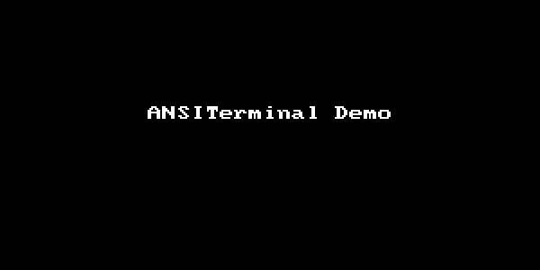

# ansiDemo

A simple program to demo [ANSITerminal](https://github.com/pakLebah/ANSITerminal) library.

The exact same demo can also be run online on this [repl.it](https://ansidemo.beejay.repl.run)'s web terminal, without any modifications, except removing the `import ANSITerminal` because repl.it doesn't allow custom libraries. You could use ANSITerminal as include files on [repl.it](https://repl.it).
